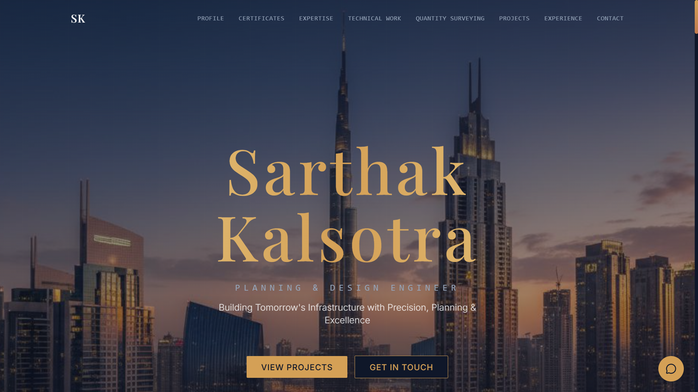

# 🌐 Sarthak's Portfolio



A modern **developer portfolio website** showcasing projects, skills, and creative work.  
This project is designed to present a developer's work, experience, and contact information in an engaging and visually appealing format.

---

## 🚀 Features

- Modern animated portfolio layout
- Smooth scrolling animations
- Project showcase section
- Skills and technologies section
- Links to social profiles
- Downloadable resume
- Fully responsive design
- Interactive UI using JavaScript animations

---

## 🛠 Technologies Used

- **HTML5** – Website structure
- **CSS3** – Styling and layout
- **JavaScript** – Interactivity
- **GSAP** – Animation library
- **Locomotive Scroll** – Smooth scrolling effects

---

## 📂 Project Structure

```
Sarthak-s-Portfolio/
├── index.html # Main webpage
├── style.css # Styling
├── script.js # JavaScript logic
│
├── images/ # Images and icons
├── images/work/ # Portfolio project images
│
├── SarthakResume.pdf # Downloadable resume
└── favicon files
```
---

## ⚙️ Installation

Clone the repository:

```bash
git clone https://github.com/Anant-Dev925/Sarthak-s-Portfolio.git
```

Navigate to the project folder:
cd Sarthak-s-Portfolio
Open the project:
open index.html
Or simply open index.html in your browser.

---

## 🎨 Customization

You can easily customize the portfolio:
Edit index.html to update content
Replace images inside the images/ folder
Modify styles in style.css
Update animations in script.js
Replace the resume file with your own

---


## 👨‍💻 Author

Anant Dev Mishra
Developer • Designer • Creator

## 📄 License

This project is open-source and available under the MIT License.

